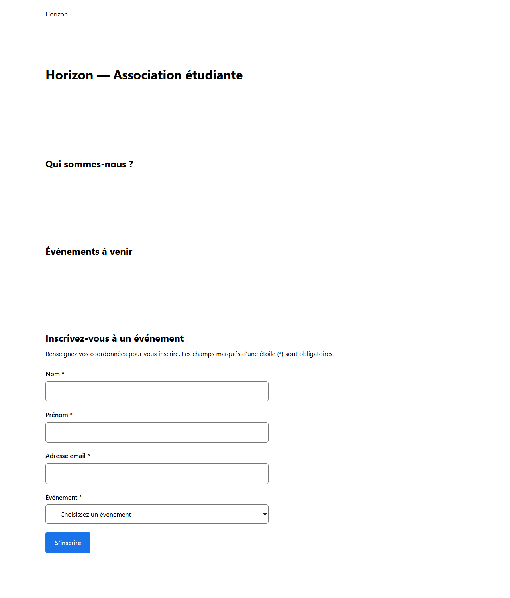

# Evaluation_Git_Hub_ESGIbdx

## Fonctionnalité C — Inscription à un événement

Section `#inscription` de [`index.html`](index.html), réalisée par @TomLeDev (étudiant 3).
Le visiteur renseigne ses coordonnées et choisit l'événement auquel il souhaite participer.

### Fonctionnement

1. Le visiteur remplit le formulaire et clique sur **S'inscrire**.
2. `inscription.js` vérifie chaque champ. Si un champ est invalide, la soumission est bloquée,
   un message d'erreur s'affiche sous le champ concerné et le focus se place sur le premier champ en erreur.
   L'erreur disparaît dès que le champ est corrigé.
3. Si tout est valide, un message de confirmation s'affiche et le formulaire est vidé.

### Champs

| Champ | Type | Règle de validation |
|-------|------|---------------------|
| Nom | texte | obligatoire (des espaces seuls sont refusés) |
| Prénom | texte | obligatoire (des espaces seuls sont refusés) |
| Adresse email | email | obligatoire, au format `nom@domaine.ext` |
| Événement | liste déroulante | obligatoire, un seul choix parmi les trois événements du catalogue |

### Pas de backend, pas de stockage

L'inscription est **simulée** : aucune donnée n'est envoyée à un serveur (ni `fetch`, ni `XMLHttpRequest`)
et rien n'est conservé (ni `localStorage`, ni cookie). Les valeurs saisies servent uniquement à
construire le message de confirmation, qui rappelle lui-même qu'il s'agit d'une simulation.
Ce comportement est vérifié dans le [rapport de tests](docs/testsInscription.md).

### Fichiers

| Fichier | Rôle |
|---------|------|
| [`index.html`](index.html) | Structure du formulaire dans la section `#inscription` |
| [`inscription.css`](inscription.css) | Style du formulaire, affichage responsive |
| [`inscription.js`](inscription.js) | Validation et soumission simulée |
| [`docs/testsInscription.md`](docs/testsInscription.md) | Scénarios de test et résultats |

### Captures d'écran

Affichage sur ordinateur :

Affichage sur mobile :

## Questions de synthèse

### 7. Comment GitHub Projects et les Issues facilitent-ils organisation et traçabilité ?

*Réponse de @TomLeDev (Étudiant 3)*

Les Issues servent à découper le projet en tâches claires : chacune a une description, des critères pour savoir quand elle est terminée, un responsable et un jalon (milestone) qui la rattache à une fonctionnalité. Chacun sait donc ce qu'il a à faire et comment vérifier que c'est fait. GitHub Projects donne la vue d'ensemble : le Kanban montre l'avancement de chaque tâche et la Roadmap l'ordre prévu et les dépendances.

Pour la traçabilité, on relie tout : le numéro de l'issue dans les messages de commit (`(#3)`), puis `Closes #3` dans la Pull Request. On peut ainsi partir d'un changement et retrouver la tâche qui l'a demandé et la personne qui en était responsable. À noter : nos PR visent `develop` et pas `main`, donc GitHub ne ferme pas les issues tout seul à la fusion (il ne le fait que sur la branche par défaut). Il faut les fermer à la main ou les citer dans la PR de release vers `main`.

### 8. Comment retrouver l'origine d'une modification dans l'historique GitHub ?

*Réponse de @TomLeDev (Étudiant 3)*

Sur GitHub, le bouton **Blame** d'un fichier affiche pour chaque ligne le dernier commit qui l'a modifiée et son auteur. En cliquant sur le commit, on voit son message (qui contient le numéro de l'issue) et la Pull Request associée, avec la discussion et les revues : on comprend qui a changé quoi, quand et pourquoi. Le bouton **History** d'un fichier permet de suivre toutes ses modifications dans le temps.

En ligne de commande, `git log` (avec `--oneline --graph` pour voir les branches) donne l'historique, `git log -- fichier` celui d'un seul fichier, `git show <sha>` le détail d'un commit et `git blame fichier` le même résultat que sur GitHub. Les tags de version (comme `v1.0`) indiquent dans quelle version une modification est arrivée, et `git bisect` aide à trouver le commit qui a introduit un bug.
